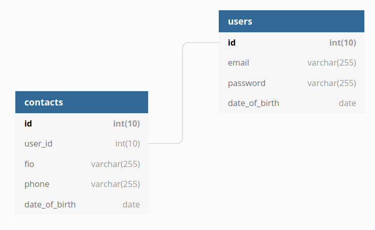

# phonebook

Simple CRUD application build on PyQT4 and Python2.7.
> Разрабатывалось как тестовое задание

## Установка и настройка

Процесс установки описан для систем на базе Ubuntu 20.04

### Установка Python2.7, PyQt4, mariadb

#### Установка Python и MariaDB

```bash
sudo apt install python2 python-mysqldb mariadb-server
```

Для систем на базе Ubuntu 20.04 необходимо скачать пакеты PyQt4 отдельно, так как они больше не поддерживаются дистрибутивом и не могут быть скачаны из официальных репозиториев.

#### **Добовляем репозиторий**

```bash
sudo add-apt-repository ppa:rock-core/qt4
sudo apt-get update
```

#### **Скачиваем PyQt4**

По желанию, выбрать директорию для скачивания, например

```bash
cd ~/Downloads
```

Затем, скачиваем пакеты в

```bash
wget http://archive.ubuntu.com/ubuntu/pool/universe/q/qt-assistant-compat/libqtassistantclient4_4.6.3-7build1_amd64.deb
wget http://archive.ubuntu.com/ubuntu/pool/universe/p/python-qt4/python-qt4_4.12.1+dfsg-2_amd64.deb
wget http://archive.ubuntu.com/ubuntu/pool/universe/p/python-pyaudio/python-pyaudio_0.2.11-1build2_amd64.deb
```

#### Устанавливаем скачанные пакеты

```bash
sudo apt install ./libqtassistantclient4_4.6.3-7build1_amd64.deb ./python-pyaudio_0.2.11-1build2_amd64.deb ./python-qt4_4.12.1+dfsg-2_amd64.deb
```

### Настройка MariaDB

Подключитесь к MariaDB с правами администратора.
Схема базы базы данных выглядит следующим образом:


#### Создание пользователя и базы данных

Выполните следующий SQL запрос что-бы создать базу данных и пользователя для работы приложения. В случае необходимости можно поменять данные пользователя и название базы данных, однако эти изменения так же необходимо внести в файл db_config.json

```sql
CREATE USER api@localhost IDENTIFIED BY 'mariadb';
create database 'phonebook';
grant all privileges on phonebook.* to api@localhost; flush privileges;
```

#### Создание таблиц

Создание таблицы "пользователи". Для этого выполните этот запрос:

```sql
CREATE TABLE phonebook.users (
  id int(10) unsigned NOT NULL AUTO_INCREMENT,
  email varchar(255) NOT NULL,
  password varchar(255) NOT NULL,
  date_of_birth date NOT NULL,
  PRIMARY KEY (id),
  UNIQUE KEY unique_users (email)
) ENGINE = InnoDB AUTO_INCREMENT = 13 DEFAULT CHARSET = utf8mb4;
```

Создание таблицы "контакты". Для этого выполните этот запрос:

```sql
CREATE TABLE phonebook.contacts (
  id int(10) unsigned NOT NULL AUTO_INCREMENT,
  user_id int(10) unsigned NOT NULL,
  fio varchar(255) NOT NULL,
  phone varchar(255) NOT NULL,
  date_of_birth date NOT NULL,
  PRIMARY KEY (id),
  UNIQUE KEY unique_records (user_id, fio, phone, date_of_birth),
  CONSTRAINT contacts_to_users FOREIGN KEY (user_id) REFERENCES users (id) ON DELETE CASCADE ON
  UPDATE
    CASCADE
) ENGINE = InnoDB AUTO_INCREMENT = 19 DEFAULT CHARSET = utf8mb4;
```

<!-- ## Использование программы

### Интерфейс входа -->
